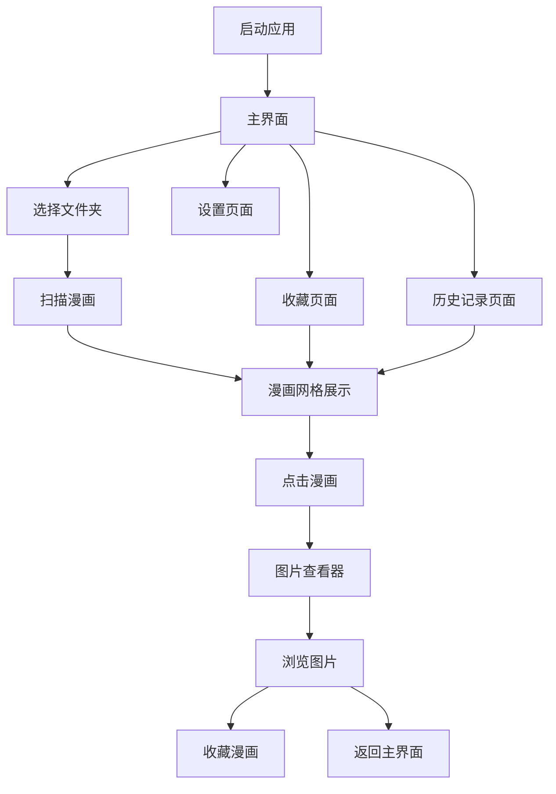

# 漫画阅读器产品需求文档 (PRD)

## 1. 产品概述

漫画阅读器是一款采用现代iPhone风格设计的桌面漫画管理和阅读工具，专为漫画爱好者打造。产品通过智能扫描、瀑布流展示和高级图片查看功能，为用户提供流畅的漫画阅读体验。

产品解决了传统文件夹浏览漫画的痛点，提供了现代化的界面设计和便捷的管理功能，让用户能够高效地组织、浏览和阅读本地漫画收藏。

目标市场：桌面端漫画阅读用户，追求高质量阅读体验和现代化界面设计的用户群体。

## 2. 核心功能

### 2.1 用户角色

本产品为单用户桌面应用，无需区分用户角色，所有功能对用户开放。

### 2.2 功能模块

我们的漫画阅读器包含以下主要页面：

1. **主界面**：现代化导航栏、路径选择、漫画网格展示、状态栏
2. **图片查看器**：全屏图片浏览、缩放控制、导航控制、幻灯片播放
3. **收藏管理页面**：收藏列表展示、收藏状态管理
4. **历史记录页面**：最近浏览记录、快速访问
5. **设置页面**：应用配置、主题设置、快捷键配置

### 2.3 页面详情

| 页面名称   | 模块名称   | 功能描述                                       |
| ------ | ------ | ------------------------------------------ |
| 主界面    | 导航栏    | 提供文件夹浏览、扫描、收藏、历史记录快速访问按钮，显示当前路径            |
| 主界面    | 漫画网格   | 瀑布流展示漫画封面，显示漫画名称、图片数量、收藏状态，支持点击打开和收藏切换     |
| 主界面    | 状态栏    | 显示当前操作状态、扫描进度、漫画统计信息                       |
| 图片查看器  | 图片显示区域 | 高质量图片预览，支持多种缩放模式（适应窗口、原始大小、自定义缩放10%-1000%） |
| 图片查看器  | 控制栏    | 上一张/下一张导航、缩放控制、旋转功能、全屏切换、幻灯片播放             |
| 图片查看器  | 信息面板   | 显示图片信息、EXIF数据、当前位置（第X张/共Y张）                |
| 收藏管理页面 | 收藏列表   | 展示已收藏的漫画，支持取消收藏、快速打开                       |
| 历史记录页面 | 历史列表   | 显示最近浏览的漫画（默认10个），支持清理无效记录                  |
| 设置页面   | 基本设置   | 主题选择、自动切换相册开关、切换提示开关                       |
| 设置页面   | 快捷键设置  | 显示所有快捷键列表，支持自定义配置                          |

## 3. 核心流程

### 主要用户操作流程

**漫画浏览流程：**
用户启动应用 → 选择漫画文件夹 → 扫描漫画 → 浏览漫画网格 → 点击打开漫画 → 图片查看器中浏览图片 → 可选择收藏或返回主界面

**收藏管理流程：**
用户在主界面或图片查看器中 → 点击收藏按钮 → 漫画添加到收藏列表 → 可通过收藏页面快速访问

**历史记录流程：**
用户打开任意漫画 → 自动添加到历史记录 → 可通过历史页面快速重新访问

## 4. 用户界面设计

### 4.1 设计风格

* **主色调**：深色主题 #1D1D1F（主背景），#007AFF（iOS蓝色，强调色）

* **辅助色**：#F2F2F7（浅色文本），#8E8E93（次要文本），#FF3B30（警告红色）

* **按钮样式**：圆角矩形按钮，支持悬停效果和点击反馈

* **字体**：系统默认字体，标题使用14-16px，正文使用12-14px

* **布局风格**：卡片式设计，现代化网格布局，响应式间距

* **图标风格**：使用Unicode符号和简洁的几何图标，如⭐（收藏）、📱（设备）、🔍（搜索）

### 4.2 页面设计概览

| 页面名称  | 模块名称 | UI元素                                         |
| ----- | ---- | -------------------------------------------- |
| 主界面   | 导航栏  | 深色背景#2C2C2E，按钮使用iOS蓝色#007AFF，圆角8px，悬停时透明度0.8 |
| 主界面   | 漫画网格 | 卡片式布局，白色背景，阴影效果，封面图片圆角4px，标题字体14px           |
| 主界面   | 状态栏  | 底部固定，高度30px，显示状态信息和进度条                       |
| 图片查看器 | 图片区域 | 黑色背景#000000，图片居中显示，支持缩放和拖拽                   |
| 图片查看器 | 控制栏  | 半透明背景，底部浮动，按钮圆形设计，直径40px                     |
| 收藏页面  | 收藏列表 | 与主界面网格样式一致，添加"已收藏"标识                         |
| 历史页面  | 历史列表 | 列表式布局，显示访问时间，支持清理操作                          |
| 设置页面  | 设置项  | 分组显示，开关使用iOS风格toggle，选项使用单选框                 |

### 4.3 响应式设计

产品主要面向桌面端用户，采用桌面优先的设计策略：

* 最小窗口尺寸：1100x700像素

* 推荐窗口尺寸：1400x900像素

* 支持窗口缩放，网格布局自适应调整

* 图片查看器支持全屏模式，优化大屏幕体验

* 不考虑触摸交互，专注鼠标和键盘操作优化

