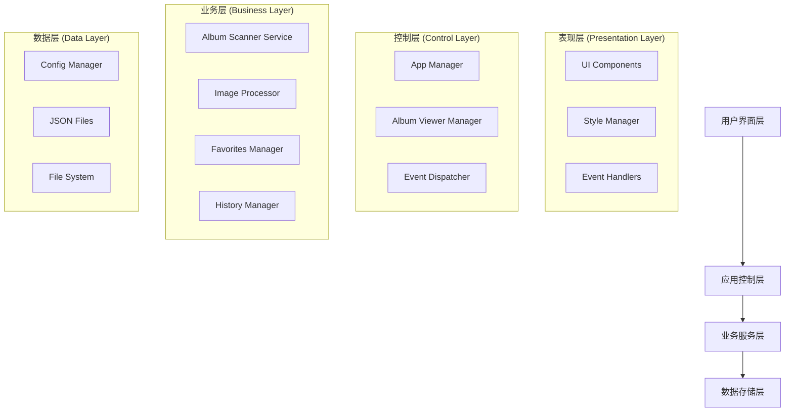
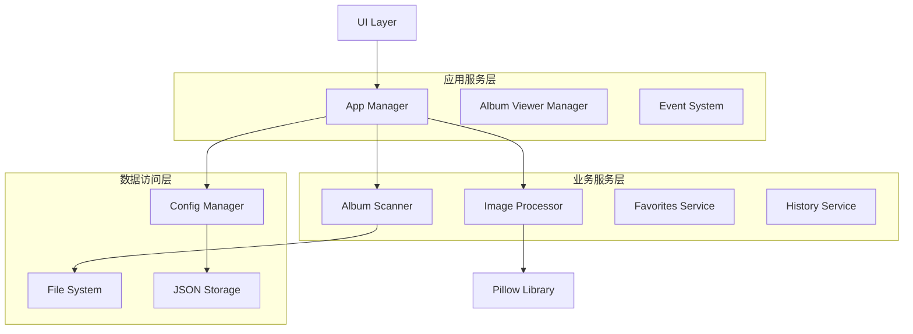
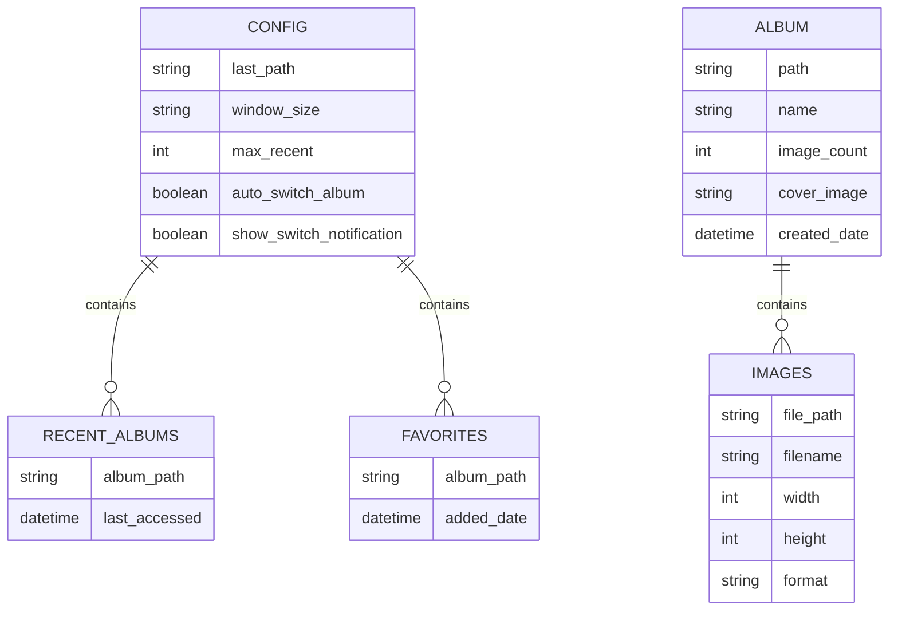

# 漫画阅读器技术架构文档 (TAD)

## 1. 架构设计



## 2. 技术描述

* **前端界面**: Python Tkinter + ttkthemes + 自定义样式系统

* **图片处理**: Pillow (PIL Fork) 10.1.0

* **数据存储**: JSON文件 + 文件系统

* **并发处理**: Python threading + concurrent.futures

* **缓存系统**: 内存缓存 + LRU算法

## 3. 路由定义

| 界面路由       | 用途               |
| ---------- | ---------------- |
| /main      | 主界面，显示漫画网格和导航功能  |
| /viewer    | 图片查看器，全屏图片浏览和控制  |
| /favorites | 收藏管理界面，显示收藏的漫画列表 |
| /history   | 历史记录界面，显示最近浏览的漫画 |
| /settings  | 设置界面，应用配置和偏好设置   |

## 4. API定义

### 4.1 核心服务接口

**漫画扫描服务**

```python
class AlbumScannerService:
    def scan_directory(self, path: str) -> List[AlbumInfo]
```

参数:

| 参数名称 | 参数类型   | 是否必需 | 描述       |
| ---- | ------ | ---- | -------- |
| path | string | true | 要扫描的目录路径 |

返回值:

| 参数名称   | 参数类型             | 描述         |
| ------ | ---------------- | ---------- |
| albums | List\[AlbumInfo] | 扫描到的漫画信息列表 |

**图片处理服务**

```python
class ImageProcessor:
    def get_image_files(self, folder_path: str) -> List[str]
    def load_image_safe(self, image_path: str) -> Optional[Image.Image]
```

**配置管理服务**

```python
class ConfigManager:
    def get_last_path(self) -> str
    def set_last_path(self, path: str) -> None
    def add_recent_album(self, album_path: str) -> None
    def add_favorite(self, album_path: str) -> None
```

示例数据结构:

```json
{
  "album_info": {
    "path": "/path/to/comic",
    "name": "漫画名称",
    "image_count": 25,
    "cover_image": "/path/to/cover.jpg",
    "is_favorite": false
  }
}
```

## 5. 服务架构图



## 6. 数据模型

### 6.1 数据模型定义



### 6.2 数据定义语言

**配置文件结构 (settings.json)**

```json
{
  "last_path": "",
  "window_size": "1400x900",
  "recent_albums": [],
  "favorites": [],
  "max_recent": 10,
  "auto_switch_album": true,
  "show_switch_notification": true
}
```

**漫画信息数据结构**

```python
@dataclass
class AlbumInfo:
    path: str
    name: str
    image_count: int
    cover_image: Optional[str] = None
    total_size: int = 0
    last_modified: Optional[datetime] = None
```

**图片信息数据结构**

```python
@dataclass
class ImageInfo:
    file_path: str
    filename: str
    width: int
    height: int
    format: str
    size: int
    exif_data: Optional[Dict] = None
```

**初始化数据**

```python
# 默认配置初始化
DEFAULT_CONFIG = {
    'last_path': '',
    'window_size': '1400x900',
    'recent_albums': [],
    'favorites': [],
    'max_recent': 10,
    'auto_switch_album': True,
    'show_switch_notification': True
}

# 支持的图片格式
SUPPORTED_FORMATS = {
    '.jpg', '.jpeg', '.png', '.gif', 
    '.bmp', '.webp', '.tiff', '.tif'
}

# 缓存配置
CACHE_CONFIG = {
    'max_thumbnail_cache': 100,
    'max_image_cache': 20,
    'thumbnail_size': (200, 200),
    'cache_cleanup_interval': 300  # 5分钟
}
```

